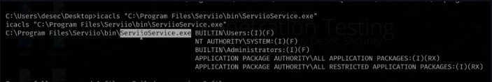

# 2. Services

When trying to change the binpath, the service may give an "Access Denies" error.
\
This means that the service is only authorized to work with that particular executable.

To take advantage of this we can try changing the executable that the service is calling in the binpath to a malicious executable.

<div align="left"><figure><figcaption></figcaption></figure></div>

Just rename the original executable and put our shell with the name of the service that is in the binpath\


<div align="left"><figure><figcaption></figcaption></figure></div>

Sending the shell with the service name to the folder.\


<div align="left"><figure><figcaption></figcaption></figure></div>

Since this service does not allow us to restart it via the command line, we can force a restart of the machine, since the service is auto-startable.

```
shutdown /r /t 0
```

When the system starts, we will receive our shell with System privileges.\


<div align="left"><figure><figcaption></figcaption></figure></div>
